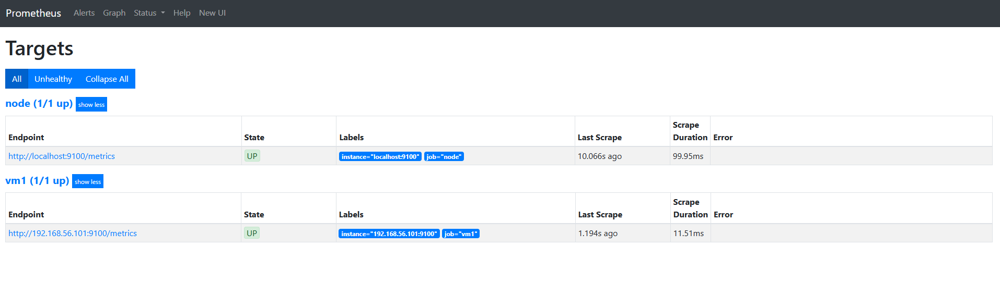

# 📊 Monitoring Lab (Prometheus + Grafana + Node Exporter)

A simple DevOps monitoring lab built using Linux virtual machines.

---

# 🧠 Overview

This project demonstrates a full monitoring stack:

- Node Exporter (metrics agent)
- Prometheus (metrics collector)
- Grafana (visualization layer)

---

# 🏗 Architecture

VM1 (ubuntu1)
    └── Node Exporter (9100)
            ↓
VM2 (ubuntu2)
    └── Prometheus (9090)
            ↓
        Grafana (3000)

---

# 🖥️ Infrastructure

## VM1 - Target Machine

- OS: Ubuntu
- Service: node_exporter
- Role: exposes system metrics
- Port: 9100

Systemd service:
- auto-start enabled
- restart on failure

---

## VM2 - Monitoring Server

### Prometheus
- scrapes metrics from VM1
- stores time-series data
- evaluates PromQL queries

### Grafana
- visualizes metrics
- dashboards:
  - CPU
  - Memory
  - Disk
  - Network

---

# 📊 Metrics collected

- CPU usage
- Memory usage
- Disk usage
- Network traffic
- System health (up metric)

---

# 📈 PromQL Queries

## CPU usage
```promql
100 - (avg by(instance)(rate(node_cpu_seconds_total{mode="idle"}[1m])) * 100)
```

---

## Memory usage
```promql
100 * (1 - (node_memory_MemAvailable_bytes / node_memory_MemTotal_bytes))
```

---

## Disk usage
```promql
100 * (1 - (node_filesystem_avail_bytes / node_filesystem_size_bytes))
```

---

## Network RX
```promql
rate(node_network_receive_bytes_total[1m])
```

## Network TX
```promql
rate(node_network_transmit_bytes_total[1m])
```

---

## System health
```promql
up
```

---

# ⚙️ Setup Summary

## Node Exporter
- installed manually
- systemd service created
- enabled at boot

## Prometheus
- configured via prometheus.yml
- targets VM1:9100

## Grafana
- connected to Prometheus datasource
- dashboards created manually

---

# 📸 Screenshots

## Grafana Dashboards

### CPU


### Memory


### Disk


### Network


---

## Prometheus

### Targets


### Query result (up metric)


---

# 📡 Ports Used

| Service        | Port |
|----------------|------|
| Node Exporter  | 9100 |
| Prometheus     | 9090 |
| Grafana        | 3000 |

---

# 🎯 Goal of Project

To understand:

- Linux monitoring
- metrics collection
- time-series databases
- visualization systems
- systemd services

---

# 🧠 Key Skills Learned

- PromQL basics
- Grafana dashboards
- Linux service management
- monitoring architecture design
- debugging metrics pipelines

---

# 👨‍💻 Author

DevOps learning project by **hattocki**

---

# 🚀 Status

✔ Node Exporter running  
✔ Prometheus scraping metrics  
✔ Grafana dashboards created  
✔ GitHub project structured  
✔ Screenshots added